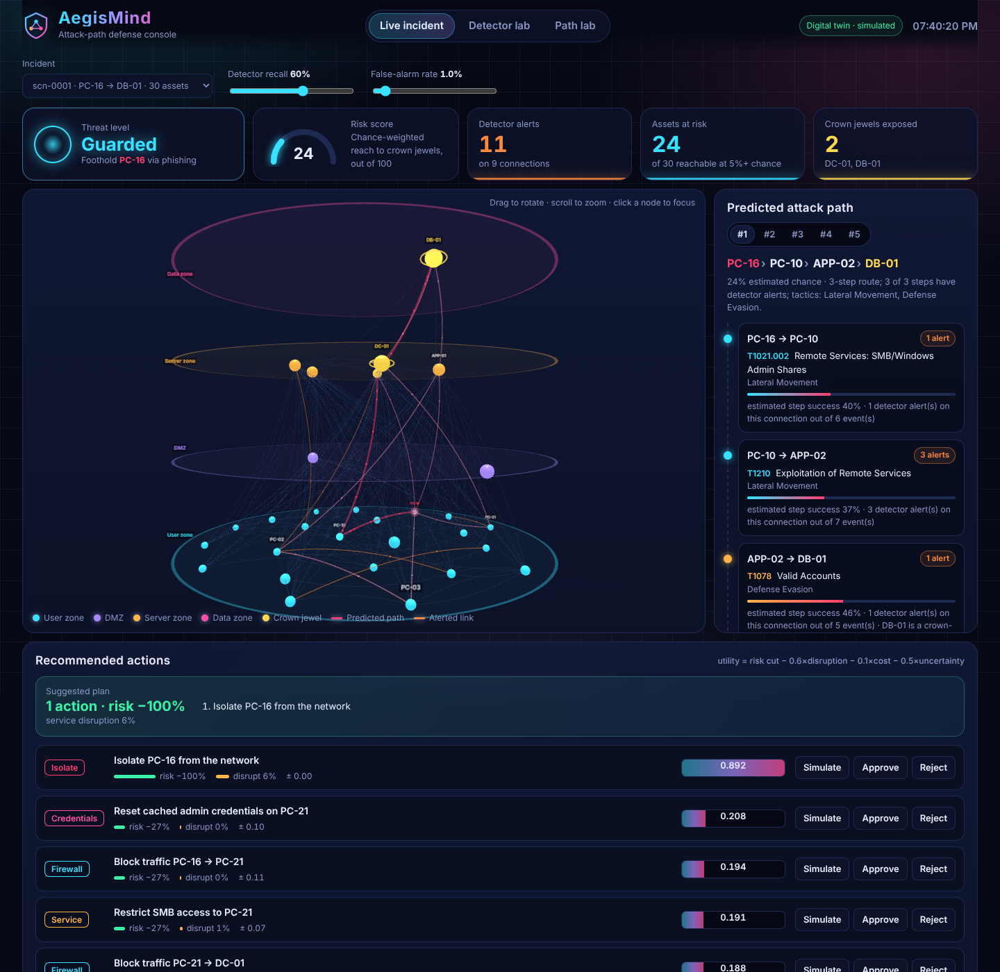

# AegisMind AI

**Graph-based cyber attack-path prediction with a digital-twin simulator and explainable, human-reviewed defense recommendations.**

B.Tech CSE major project and research prototype. AegisMind models an enterprise-like network as a graph, ranks plausible attack paths from a suspected foothold to critical assets, and tests candidate mitigations on an isolated *digital twin* before a human approves anything.

> ⚠️ **Scope and safety.** This is a research prototype, not a production security product. It works only on public datasets and synthetic or virtual lab data. It never scans, exploits or changes real systems, and every recommendation needs human review.

---

## Status

| Sprint | Work | Status |
|---|---|---|
| 1 | Repository, environment, data dictionary, threat model | ✅ Done |
| 1+ | Synthetic scenario generator with ground-truth attack paths | ✅ Done |
| 1+ | NetworkX baselines: hop-shortest and risk-weighted paths, blast radius, choke points, min-cut | ✅ Done |
| 1+ | Minimal digital-twin what-if engine and path metrics (Top-k, MRR, edge F1) | ✅ Done |
| 2 | CICIDS2017 / UNSW-NB15 loaders and leakage-aware preprocessing | ✅ Done |
| 3 | Baseline detectors (4 supervised + Isolation Forest), F1 and FPR-budget thresholds, per-family detection | ✅ Done |
| 4 | Graph-context path model fusing detector alerts with graph features; benchmark and ablation | ✅ Done |
| 5 | Defense optimizer (utility + constraints), explanations (path evidence, SHAP/occlusion), analyst feedback loop | ✅ Done |
| 6 | FastAPI backend + 3D React dashboard (network floors, attack-path particles, actions, labs) | ✅ Done |
| 7 | Evaluation, ablations and paper draft | ⏳ Next |

## Why synthetic scenarios?

Public intrusion datasets label individual *flows*, but they don't contain ground-truth *attack paths*. Without known paths you can't measure path prediction (Top-k hit rate, MRR, edge precision/recall). `aegismind.twin.generator` builds random enterprise topologies and simulated campaigns whose true path is known by construction:

- **Zones:** user, DMZ, server, data. The firewall policy blocks direct user→data traffic.
- **Assets:** workstations, admin workstations, web, mail, app, file, domain controller and database servers.
- **Relationships:** network services (SMB, RDP, SSH, HTTP, SQL, LDAP), credential reuse and domain trust.
- Each step carries a simulated `exploitability` and a MITRE ATT&CK technique tag.
- **Defender view:** the defender sees the same structure with noisy exploitability values, and the simulated attacker is deliberately not optimal (`attacker_temperature`). Both reduce the circularity between how paths are generated and how they're predicted.
- **Telemetry:** labelled flow and auth events (benign background traffic plus attack steps) are written as CSV.

## Quick start

```bash
git clone https://github.com/arju9gb123456/aegismind-ai.git
cd aegismind-ai
python -m venv .venv && source .venv/bin/activate   # Windows: .venv\Scripts\activate
pip install -r requirements-dev.txt

pytest                                            # run the test suite

python -m aegismind.cli generate --count 20       # synthetic scenarios -> data/scenarios/
python -m aegismind.cli analyze data/scenarios/scn-0001
python -m aegismind.cli benchmark --count 200     # baseline comparison -> experiments/
```

Example `analyze` output (excerpt):

```
Top predicted paths (risk-weighted, defender view):
  1. p=0.2138  PC-16 -> PC-21 -> DC-01 -> DB-01
  2. p=0.1895  PC-16 -> APP-01 -> DB-01
Ground truth: PC-16 -> PC-10 -> APP-02 -> DB-01
  step 1: PC-16 -> PC-10  [smb] T1021.002 Remote Services: SMB/Windows Admin Shares
Incident choke points (PC-16 -> DB-01):
  PC-16 -> PC-21 [smb]  -11.38%
```

Each benchmark run saves a JSON record with the date, git commit, Python version, seeds, generator config and results, so every number in the paper can be traced back to a run.

## Public datasets

Download the datasets yourself (they're free, but too large to keep in git) and follow each dataset's terms of use:

| Dataset | Put files in | Source |
|---|---|---|
| CICIDS2017 (MachineLearningCSV, 8 files) | `data/raw/cicids2017/` | https://www.unb.ca/cic/datasets/ids-2017.html |
| UNSW-NB15 (training-set and testing-set CSVs) | `data/raw/unsw-nb15/` | https://research.unsw.edu.au/projects/unsw-nb15-dataset |

```bash
python -m aegismind.cli prepare cicids2017                 # day split (default)
python -m aegismind.cli prepare cicids2017 --sample 0.3    # 8 GB RAM laptops
python -m aegismind.cli prepare cicids2017 --split random  # optimistic comparison only
python -m aegismind.cli prepare unsw-nb15                  # official train/test partition
```

`prepare` writes `train/val/test.csv.gz` and a `metadata.json` (row counts, dropped rows, features, scaler statistics, fingerprints) to `data/processed/<dataset>/`.

**Leakage controls:**
- Split first, then fit everything (scaler, constant-column removal, category vocabularies) on the training split only.
- Split by capture day (CICIDS2017) or by the official partition (UNSW-NB15) instead of random rows.
- Drop exact duplicate rows, plus val/test rows that are identical to a training row.
- Remove `Infinity`/NaN rows and identifier columns (IPs, Flow ID, Timestamp), and count everything that was dropped.

> **Note for the paper:** with the CICIDS2017 day split (train Mon–Wed, test Fri), PortScan and DDoS appear only in the test set. Binary detection on that split therefore measures generalization to *unseen* attack families. Report it as the main result and the random split as an in-distribution upper bound.

## Baseline detectors

```bash
python -m aegismind.cli detect cicids2017 --max-train-rows 300000   # quick first run
python -m aegismind.cli detect cicids2017                           # full training split
python -m aegismind.cli detect unsw-nb15
python -m aegismind.cli detect cicids2017 --fpr-budget 0.005        # stricter alert budget
python -m aegismind.cli detect cicids2017 --models random_forest,iforest
```

| Model | Type | Trained on |
|---|---|---|
| Logistic Regression, Decision Tree, Random Forest, Histogram Gradient Boosting | Supervised, class-balanced | Labelled train rows |
| Isolation Forest | Anomaly detection | **Benign train rows only**: it never sees an attack, so it targets unseen attack types |

**Two threshold strategies.** Both are chosen on the validation split and then frozen for the test split:
- `val_f1`: the threshold that maximizes F1 on validation.
- `fpr_budget`: the highest-recall threshold that keeps false positives on validation benign traffic within a budget (default **1%**). This is how alerting is tuned in practice.

**Output per strategy:** precision, recall, F1, PR-AUC, ROC-AUC, false-positive rate and the confusion matrix. Each run also reports the **detection rate per attack family**, with families never seen in training marked `NO`, and the top features (impurity importance or |coefficient|). Every run saves a JSON report to `experiments/` with the data fingerprint, seed and git commit.

> **First finding (CICIDS2017, day split, all test attacks unseen in training):** with the `val_f1` threshold the best test F1 was 0.68 (Logistic Regression, but at 10.6% FPR). Random Forest had the best ranking (PR-AUC 0.88) but missed most attacks, because the threshold tuned on Thursday's web attacks did not transfer to Friday's DDoS, PortScan and Bot traffic. The `fpr_budget` strategy and the benign-only Isolation Forest were added to study this threshold-transfer problem.

## Attack-path prediction with alert evidence (Sprint 4)

```bash
python -m aegismind.cli pathbench                                    # train 400 / test 200 scenarios
python -m aegismind.cli pathbench --test-alerts "0.6:0.01,0.37:0.0011,0.62:0.106,0.2:0.05,0:0"
```

**How it works:**
1. Every scenario's telemetry goes through a *simulated* detector with a set recall and false-positive rate. Use the measured Sprint 3 numbers here. The flagged events are counted per graph edge.
2. `graph_context+evidence` learns which next hop an attacker takes. For each candidate edge it uses edge features (exploitability, relation type), graph context (zone, criticality, distance and progress toward the target, out-degree) and alert evidence (alerts on the edge, alert rate, alerts on edges leaving the next node). A gradient-boosted classifier is trained on next-hop decisions from training seeds only.
3. Beam search turns those per-step probabilities into ranked full paths from the entry point to the target.
4. Results are compared against hop-shortest, risk-weighted and a heuristic `risk_weighted+alerts`, and against `graph_context` (no alerts) as an ablation.

**Result on 200 held-out synthetic scenarios** (trained with alerts at recall 0.6 / FPR 0.01):

| Test detector (recall / FPR) | risk_weighted MRR | risk_weighted+alerts MRR | graph_context MRR | **graph_context+evidence MRR** |
|---|---|---|---|---|
| 0.60 / 0.010 (training setting) | 0.345 | 0.627 | 0.296 | **0.902** |
| 0.37 / 0.0011 (like Random Forest, Sprint 3) | 0.345 | 0.533 | 0.296 | **0.763** |
| 0.62 / 0.106 (like Logistic Regression, Sprint 3) | 0.345 | 0.545 | 0.296 | **0.682** |
| 0.20 / 0.050 (weak detector) | 0.345 | 0.420 | 0.296 | **0.452** |
| 0 / 0 (no alerts) | 0.345 | 0.345 | 0.296 | 0.297 |

**What this shows:**
- Fusing alert evidence with graph context beats the heuristic at every detector quality level, and the gap is largest when the detector is good.
- Graph structure alone (`graph_context`) does *not* beat exploitability. In this generator the attacker chooses paths from exploitability only, so there is no extra structural signal to learn. Report this as an honest ablation and a threat to validity.
- With no alerts the model falls back to roughly the graph-only level, which is slightly below the risk-weighted baseline.
- Permutation importance confirms that alerts on the candidate edge, followed by downstream alerts, drive the predictions.

## Recommendations, explanations and feedback (Sprint 5)

```bash
python -m aegismind.cli recommend data/scenarios/scn-0001                 # explain path + rank actions
python -m aegismind.cli recommend data/scenarios/scn-0001 --protect PC-16 # never isolate PC-16
python -m aegismind.cli feedback data/scenarios/scn-0001 --action 1 --decision reject --note "CEO laptop"
python -m aegismind.cli detect cicids2017 --explain 5                     # why flows were flagged
pip install shap                                                          # optional: SHAP explanations
```

**Defense optimizer.** Candidate actions are generated from the predicted paths:
- block a connection
- restrict a service
- require MFA for privileged logins
- reset cached admin credentials
- isolate an asset

Each candidate is simulated on a copy of the digital twin and scored with the report's utility:

`Utility = risk_reduction − λ·service_disruption − µ·action_cost − ν·uncertainty`   (defaults λ=0.6, µ=0.1, ν=0.5)

- **Risk:** criticality-weighted best-path probability from the foothold to each crown jewel. Edges with detector alerts count as more likely.
- **Service disruption:** the weighted share of business connectivity that the action disables. Credential misconfigurations count as zero business value, so fixing them is "free".
- **Uncertainty:** the spread of the risk reduction when the defender's exploitability estimates are perturbed (Monte Carlo).
- **Hard constraints:** an action is rejected if it cuts workstation→app HTTP, app→database SQL or LDAP to the domain controller, or if it isolates a protected asset. Crown jewels and the domain controller are always protected.
- **Output:** ranked single actions, plus a greedy plan of up to 3 actions with a rollback note for each. Nothing is executed; every action requires human approval.

**Explanations.**
- *Path:* each step shows the ATT&CK technique, the estimated success probability, alerts out of total events, and whether the next node is a crown jewel. With the learned model, it also shows how much the alerts changed that step's probability.
- *Detector:* SHAP values when `shap` is installed (TreeExplainer or LinearExplainer); otherwise an occlusion fallback that replaces each feature with its training median. SHAP units differ by model, so compare feature rankings across models, not raw values.

**Feedback loop.** Approve or reject decisions are appended to `experiments/feedback.jsonl`. Each action type then gets a transparent penalty, `ρ·(reject_rate − 0.5)` with a Beta(1,1) prior, so action types analysts keep rejecting rank lower next time. Every decision that shaped the ranking stays on record.

## 3D dashboard (Sprint 6)



**First time only** (Node.js 18+):
```bash
cd frontend
npm install
npm run build
cd ..
```

**Every time:**
```bash
python -m aegismind.cli serve      # open http://localhost:8000
```

On first run the dashboard creates 12 demo incidents in `data/scenarios/` if that folder is empty.

| View | What it shows |
|---|---|
| **Live incident** | Threat level, risk gauge and KPIs. A 3D map with each network zone on its own floor: user, DMZ, server and data. Crown jewels are gold with a spinning ring, the foothold pulses red, and particles flow along the predicted attack path. Hover a node or link for details; click a node to focus it or mark it "never isolate". Detector recall and false-alarm sliders update everything live. |
| **Predicted attack path** | The top 5 ranked paths, each step with its ATT&CK technique, alerts and estimated success. A toggle overlays the actual path (synthetic scenarios only). |
| **Recommended actions** | Ranked actions with risk cut, disruption, uncertainty and utility. **Simulate** runs the what-if on the twin and greys out the blocked links in 3D. **Approve/Reject** feeds the learning loop. |
| **Detector lab** | F1 per model across datasets and splits, a best-F1 vs 1% false-alarm toggle, and a per-attack-family heatmap with "unseen" badges. Data comes from `experiments/detectors_*.json`. |
| **Path lab** | MRR of every path method across detector quality levels, plus the path model's feature importance. Data comes from `experiments/pathbench_*.json`. |

**Frontend development** (hot reload): run `python -m aegismind.cli serve` in one terminal and `cd frontend && npm run dev` in another, then open http://localhost:5173. API calls are proxied to port 8000. API docs are at http://localhost:8000/docs.

Stack: FastAPI · React 19 · TypeScript · Vite · three.js / react-force-graph-3d · Recharts · Framer Motion.

## Repository layout

```
aegismind/
  twin/
    topology.py     # Asset / Edge / Topology model, JSON I/O, NetworkX export
    generator.py    # synthetic topologies, campaigns (ground truth), telemetry
    attack_kb.py    # MITRE ATT&CK technique labels for simulated steps
    whatif.py       # apply simulated actions to a copy of the twin, compare
  data/
    cicids.py       # CICIDS2017 loader (header, Infinity, label-encoding quirks)
    unsw.py         # UNSW-NB15 loader (official partition, categoricals)
    preprocess.py   # clean -> split -> fit-on-train -> save, with metadata
  defense/
    optimizer.py    # action catalog, utility, constraints, greedy plan
    feedback.py     # analyst approve/reject log -> preference penalty
  explain.py        # path evidence explanations; SHAP / occlusion for detectors
  api/app.py        # FastAPI backend for the dashboard
  detect/
    baseline.py     # classical detectors, thresholds, per-family metrics
  graph/
    paths.py        # path baselines, blast radius, choke points, min-cut
    metrics.py      # Top-k hit, MRR, edge P/R/F1, next-hop accuracy
    evidence.py     # simulated detector alerts aggregated per graph edge
    learned.py      # graph-context next-hop model + beam search
    pathbench.py    # path benchmark: baselines vs learned, alert sweeps
  cli.py            # generate | analyze | prepare | detect | benchmark | pathbench | recommend | feedback | serve
frontend/           # React + TypeScript + three.js dashboard (Vite)
configs/default.yaml
docs/               # data dictionary, threat model
tests/
data/               # raw/, processed/, scenarios/ (git-ignored)
experiments/        # benchmark records (git-ignored)
```

## Documentation

- [Data dictionary](docs/data_dictionary.md)
- [Threat model and scope](docs/threat_model.md)

## Future scope

- **Infrastructure health signals in the digital twin.** Examples are disk SMART data, disk-capacity trends, link errors and port status. An unhealthy or overloaded asset changes both the attack paths and the cost of a defensive action. This is out of scope for the current security-focused prototype.
- Evaluation on authorized lab telemetry, such as Zeek logs from an isolated virtual network.
- Temporal graph models and calibrated uncertainty for path predictions.

## Tech stack

Python · NetworkX · pandas · scikit-learn · FastAPI · PostgreSQL · React + TypeScript · Cytoscape.js · Docker

## License

MIT. See [LICENSE](LICENSE).

---

Made by Arjun Ahirwar
